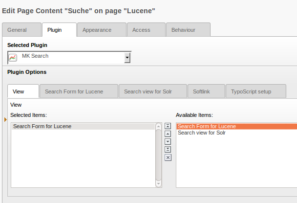

Anlegen und Einrichten des Plugins
==================================

Für jede Suchmaschine wird im FE-Plugin ein eigener View bereitgestellt.

Die Extension mksearch stellt ein Frontent-Plugin für die Suchmaske und die Ausgabe der Ergebnisse bereit. Die Ausführung ist aber speziell für die einzelnen Suchmaschinen implementiert, so dass die Möglichkeiten der Suchmaschinen optimal ausgenutzt werden können. Wenn man also ein Plugin einrichtet, muss man sich zunächst die verwendete Suchmaschine aussuchen. Anschließend setzt man die weiteren Einstellungen im jeweiligen Tab der Suchmaschine.Es gibt keine getrennten Views für das Suchformular und die Darstellung der Ergebnisliste. Mksearch arbeitet grundsätzlich nur mit Ergebnislisten, welche durch konfigurierbare Filter eingeschränkt werden können. Die Filter wiederum können HTML-Formulare verwenden, müssen das aber nicht. Vorkonfiguriert sind natürlich Filter, die ein Suchformular rendern. Ein Filter ist immer eine PHP-Klasse, welche per Typoscript konfiguriert wird. So ist es sehr leicht möglich auch eigene Filter zu integrieren.

View für Zend Lucene
--------------------

Für Zend Lucene sind die bisherigen Einstellungen noch recht überschaubar. Man muss lediglich noch den Index angeben, der verwendet werden soll. Außerdem können die HTML-Templates angegeben werden. Wenn die Felder leer bleiben, werden natürlich automatisch die mitgelieferten Templates genutzt.

In mksearch werden die HTML-Template für die Ausgabe des Suchformulars und der Ergebnisliste getrennt behandelt. In der Ergebnisliste wird das Suchformular lediglich als einzelner Marker integriert. Die Subparts für beide Vorlagen befinden sich in der Datei EXT:mksearch/templates/searchlucene.html.

View für Apache Solr
--------------------

Die Konfiguration der Suche für Solr hängt entscheidend von den Einstellungen in der solrconfig.xml ab. Wenn man mit Solr arbeitet, sollte/muss bspw. für jeden Typ einer Suche ein eigener Request-Handler angelegt werden.

Es ist unbedingt darauf zu achten den default request-Handler (name=standard) in den Beispiel solrconfig.xml Dateien in mksearch in die eigene solrconfig.xml unverändert zu übernehmen. Dieser request-Handler wird im Backend für das Modul und die Indizierung verwendet.

Folgende Einstellungen können getroffen werden:

**Search Index to use**

Stellen Sie hier den Solr-Index ein, der für die Suche verwendet werden soll.

**Filter**

Diese Option ist wichtig, wenn Sie einen eigenen Request-Handler verwenden. Legen Sie dann hier den Typ dieses Request-Handlers fest.

**Request handler**

Geben Sie den Namen des Request-Handlers an, der für die Suche verwendet werden soll. Wenn dieses Feld leer bleibt, dann sollte der Wert über TS gesetzt werden. Es ist keinesfalls empfehlenswert den request-Handler nicht zu konfigurieren!!! In diesem Fall würde der default request-Handler verwendet werden, welcher in solrconfig.xml konfiguriert ist. Dieser wird aber im Backend verwendet und sollte daher nicht verändert werden. Somit ist der default request-Handler für gewöhnlich nicht für eine Suche geeignet.

**Force Search**

Wenn diese Option gesetzt ist, wird beim ersten Laden der Suche sofort eine Suchanfrage ohne Parameter abgesetzt. Somit erscheint eine Ergebnisliste mit allen Treffern.

**Enable Autocomplete/suggest**

Aktivierung des Autocomplete im Eingabefeld der Suchmaske. Beachten Sie hierzu auch die Hinweise im Abschnitt **Autocomplete** !

**Include jQuery main / jQuery UI-Core / UI Autosuggest**

Über diese Optionen können Sie regeln, ob die notwendigen JavaScript-Bibliotheken für den Autosuggest von mksearch eingebunden werden sollen. Da jQuery in vielen Umgebungen bereits verhanden ist, kann somit eine doppelte Einbindung vermieden werden.

**Debug Filter query**

Wenn diese Option gesetzt ist, werden im Frontend ausführliche Daten über die Solr-Anfrage und das gelieferte Ergebnis angezeigt. Dies ist oft hilfreich, wenn Solr nicht die erwarteten Ergebnisse liefert. Nutzen Sie in diesen Fällen die angezeigte Request-URL als Ausgangspunkt für die Analyse im Solr-AdminPanel.

**Filter class**

Die Filterklasse steuert den Zugriff auf Solr. Die voreingestellte Klasse sollte für alle normalen Anwendungsfälle ausreichend sein. Dieser Filter unterstützt Suchanfragen mit und ohne Suchformular.

**Main marker class**

Diese Klasse bereitet die Ergebnisse von Solr für die Darstellung im Frontend auf. Die eingestellte Klasse sollte nicht geändert werden.

**Subpart for search formular**

Das mitgelieferte HTML-Template für das Suchformular enthält drei verschiedene Varianten des Formulars. Mit diesem Parameter können Sie die gewünschte Form einstellen. Mitgeliefert werden folgende Subparts:

-   \#\#\#SIMPLE\#\#\#
-   \#\#\#HEAD\#\#\#
-   \#\#\#FORM\#\#\#

Probieren Sie die einzelnen Formulare einfach mal aus. Natürlich können Sie auf diesen Weg auch eigene Suchformulare anlegen, ohne die vorhandenen Vorlagen zu verändern.

**Template for search formular**

Festlegung einer eigenen HTML-Vorlagedatei für das Suchformular.

**Subpart for result list**

Für die Ergebnisliste können Sie ebenfalls in einer HTML-Datei mehrere Varianten in verschiedenen Subparts anlegen. Der gewünschte Subpart kann dann hier eingetragen werden. Mitgeliefert wird der Subpart \#\#\#SEARCH\#\#\#.

**Template for result list**

Festlegung einer eigenen HTML-Vorlagedatei für die Ergebnisliste.

View für ElasticSearch
----------------------

Die Konfiguration der Suche für ElasticSearch erfoltg nicht nur über das Plugin sondern kann auch direkt in ElasticSearch vorgenommen werden.

Folgende Einstellungen können getroffen werden:

**Search Index to use**

Stellen Sie hier den ElasticSearch-Index ein, der für die Suche verwendet werden soll.

**Debug Filter query**

Wenn diese Option gesetzt ist, werden im Frontend ausführliche Daten über die Such-Anfrage und das gelieferte Ergebnis angezeigt. Dies ist oft hilfreich, wenn ElasticSearch nicht die erwarteten Ergebnisse liefert.

**Template for search formular**

Festlegung einer eigenen HTML-Vorlagedatei für das Suchformular.

**Subpart for result list**

Für die Ergebnisliste können Sie ebenfalls in einer HTML-Datei mehrere Varianten in verschiedenen Subparts anlegen. Der gewünschte Subpart kann dann hier eingetragen werden. Mitgeliefert wird der Subpart \#\#\#SEARCH\#\#\#.

**Force Search**

Wenn diese Option gesetzt ist, wird beim ersten Laden der Suche sofort eine Suchanfrage ohne Parameter abgesetzt. Somit erscheint eine Ergebnisliste mit allen Treffern.
